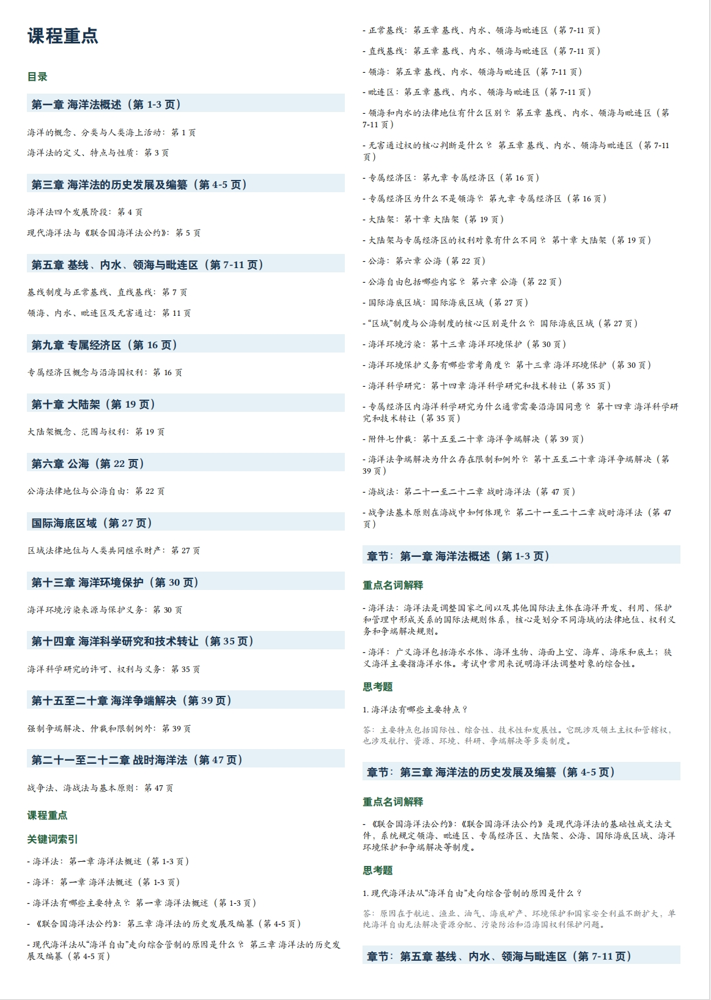

<h1 align="center">BeforeU-open</h1>

<p align="center">
  
  
  
</p>

<p align="center">
  把课程 PDF、PPT、PPTX 整理成适合开卷考试使用的打印资料包：压缩课件、标清页码、生成目录，再用 AI 整理课程重点和关键词索引。
</p>


> 开卷考试不是资料越多越好，而是要把“找知识点”的成本提前降下来。

## 目录

- [适合场景](#适合场景)
- [核心输出](#核心输出)
- [效果示例](#效果示例)
- [安装教程](#安装教程)
- [快速开始](#快速开始)
- [输出结构](#输出结构)
- [AI 分析结果格式](#ai-分析结果格式)
- [输出规范](#输出规范)
- [测试](#测试)

## 适合场景

- 考试允许带纸质资料，但课件太多、页数太散。
- PPT/PDF 里有大量定义、图表、公式、案例，临场翻找很慢。
- 需要把课程资料整理成“打印版 + 目录 + 课程重点”的组合。
- 希望保留页码定位，让目录和重点能直接指向打印资料。

## 核心输出

| 文件 | 用途 |
| --- | --- |
| `开卷考打印版.pdf` | 把课程材料拼成紧凑打印版，并写入可见 `第 X 页` 页码。 |
| `目录.pdf` | 第一阶段生成的页码目录，用于快速定位打印页。 |
| `课程重点.pdf` | 第二阶段生成的复习索引，默认把目录合并在开头。 |
| `_support/` | 保存 AI 输入、AI 结果模板、页码映射、Typst/Markdown 中间文件和运行报告。 |

第二阶段默认只在根目录保留 `开卷考打印版.pdf`、`课程重点.pdf` 和 `_support/`，避免考前资料夹变乱。

## 效果示例

`课程重点.pdf` 会把目录、关键词索引、重点名词解释和思考题合并到同一份资料里，适合考前快速定位。



`开卷考打印版.pdf` 会把课件内容压缩成带页码的拼版打印资料，目录和重点中的页码都以这份 PDF 为准。


## 安装教程

### 1. 获取项目

```bash
git clone https://github.com/beforeugone520/BeforeU-open.git
cd BeforeU-open
```

如果你已经下载了源码，直接进入项目目录即可。

### 2. 安装 Python 依赖

建议使用虚拟环境，避免污染系统 Python：

```bash
python3 -m venv .venv
source .venv/bin/activate
python3 -m pip install -U pip
python3 -m pip install -r requirements.txt
```

### 3. 安装系统依赖

BeforeU-open 需要 Python 包和几个本地命令行工具协同工作：

| 依赖 | 必需 | 作用 | 检查方式 |
| --- | --- | --- | --- |
| Python 3.10+ | 是 | 运行整理脚本和测试 | `python3 --version` |
| PyMuPDF | 是 | 拼装 PDF、写入页码 | `python3 -c "import fitz"` |
| LibreOffice | 是 | 将 PPT/PPTX 转成 PDF | `soffice --version` 或 `libreoffice --version` |
| Typst | 是 | 渲染目录和课程重点 PDF | `typst --version` |
| officecli | 否 | 增强 PPTX 文本和结构提取 | `officecli --version` |

Ubuntu / Debian：

```bash
sudo apt-get update
sudo apt-get install -y libreoffice

# Typst 可通过 Rust 安装；如果没有 Rust，也可以从 Typst GitHub Releases 下载二进制。
cargo install typst-cli
```

macOS：

```bash
brew install --cask libreoffice
brew install typst
```

Windows：

- 推荐在 WSL 中运行 BeforeU-open。
- LibreOffice 从官网下载安装，并确保 `soffice` 或 `libreoffice` 能在终端中调用。
- Typst 从 GitHub Releases 下载，或在支持的包管理器中安装。

officecli 是可选依赖；需要增强 PPTX 解析时再安装：

```bash
curl -fsSL https://raw.githubusercontent.com/iOfficeAI/OfficeCLI/main/install.sh | bash
```

### 4. 检查依赖

```bash
python3 scripts/check_dependencies.py
```

期望看到类似输出：

```text
OK: PyMuPDF (required) - Python package fitz
OK: LibreOffice (required) - /path/to/soffice
OK: Typst (required) - /path/to/typst
OK: officecli (optional) - /path/to/officecli
```

也可以运行自动安装辅助脚本：

```bash
python3 scripts/install_dependencies.py
```

这个脚本会尝试自动安装 PyMuPDF；LibreOffice、Typst、officecli 这类系统工具会输出对应安装命令，需要按本机环境手动处理。

### 5. 安装 Skill

推荐直接把项目地址发给你正在使用的 agent，让它自动安装：

```text
https://github.com/beforeugone520/BeforeU-open 帮我安装这个 skill 吧
```

这句话适合发给 Codex、Claude Code、OpenCode 等支持本地 skill 的 agent。安装后，用下面这句话检查它是否已经识别：

```text
你能使用 beforeu-open 这个 skill 吗？
```

也可以手动克隆到 Codex skills 目录：

```bash
mkdir -p "${CODEX_HOME:-$HOME/.codex}/skills"
git clone https://github.com/beforeugone520/BeforeU-open.git \
  "${CODEX_HOME:-$HOME/.codex}/skills/beforeu-open"
```

如果已经安装过，更新时运行：

```bash
cd "${CODEX_HOME:-$HOME/.codex}/skills/beforeu-open"
git pull
```

调用名：

```text
$beforeu-open
```

示例：

```text
$beforeu-open 帮我把 /path/to/course-materials 整理成开卷考试打印资料包
```

## 快速开始

### 1. 准备课程资料

把课程 PDF、PPT、PPTX 放进同一个文件夹，例如：

```text
course-materials/
  第01讲 绪论.pptx
  第02讲 基本概念.pdf
  复习范围.pdf
```

建议先按课堂顺序整理文件名，脚本会尽量按自然顺序处理。

### 2. 选择合并规格

执行前必须先选合并规格，脚本不会静默使用默认值：

| 规格 | 每页格数 | 适合情况 |
| --- | ---: | --- |
| `4x4` | 16 | 字号相对大，适合内容密、截图多的课件。 |
| `5x4` | 20 | 清晰度和压缩率比较均衡。 |
| `5x5` | 25 | 最省页数，但单格内容更小。 |

### 3. 第一阶段：生成打印资料和 AI 输入

```bash
python3 scripts/open_book_exam.py /path/to/course-materials \
  --grid 4x4 \
  --install-missing \
  --exam-brief "考试范围、题型、老师提示"
```

第一阶段会生成：

- `开卷考打印版.pdf`
- `目录.pdf`
- `_support/页码映射.csv`
- `_support/AI分析输入.json`
- `_support/AI分析结果模板.json`

### 4. 让 Codex 生成 AI 分析结果

第一阶段完成后，把 `_support/AI分析输入.json` 交给 Codex，让它按 `_support/AI分析结果模板.json` 写出：

```text
_support/AI分析结果.json
```

这个 JSON 会决定 `课程重点.pdf` 里的目录、关键词索引、重点名词解释和思考题。

### 5. 第二阶段：生成课程重点

Codex 根据 `_support/AI分析输入.json` 写出 `AI分析结果.json` 后，再运行：

```bash
python3 scripts/open_book_exam.py /path/to/course-materials \
  --grid 4x4 \
  --analysis-json /path/to/AI分析结果.json
```

如果 `--analysis-json` 没有同时指定 `--output-dir`，脚本会复用该输入路径下最新的 `开卷考输出-*` 目录。

### 6. 打印前检查

生成后优先检查：

- `开卷考打印版.pdf` 是否每页都有清晰的 `第 X 页`。
- `课程重点.pdf` 的目录页码是否能对应到打印版。
- 公式、表格、图片是否足够清楚。
- 如果单格太小，改用 `--grid 4x4` 重新生成。

公式输入支持 LaTeX 风格的 `$...$` 和 `$$...$$`，最终由 Typst 渲染，不需要 TeX Live 或 XeLaTeX。

## 输出结构

```text
开卷考输出-<timestamp>/
  开卷考打印版.pdf
  目录.pdf            # 第一阶段生成；第二阶段默认从根目录移除
  课程重点.pdf        # 提供 AI分析结果.json 后生成，默认包含目录
  _support/
    AI分析输入.json
    AI分析结果模板.json
    AI分析结果.json
    页码映射.csv
    运行报告.md
    markdown/
    typst/
    converted-pdf/
```

## AI 分析结果格式

`课程重点.pdf` 必须来自 AI 编写的 `AI分析结果.json`，不能只依赖脚本启发式规则。

```json
{
  "课程名称": "课程名",
  "目录": [
    {
      "章节": "章节名",
      "小节": "适合查找的小标题",
      "拼版页": 6
    }
  ],
  "重点": [
    {
      "章节": "章节名",
      "关键词或思考题": "【重点名词解释】关键词",
      "解释或答案": "简明解释，可包含公式，例如 $E = mc^2$。"
    },
    {
      "章节": "章节名",
      "关键词或思考题": "【思考题】问题？",
      "解释或答案": "答：直接答案。"
    }
  ]
}
```

## 输出规范

- `开卷考打印版.pdf` 是页码权威。
- 第一阶段 `目录.pdf` 使用打印 PDF 页码范围，例如 `第 1-3 页`。
- 第二阶段默认不在根目录保留单独 `目录.pdf`；目录作为 `课程重点.pdf` 的第一部分。
- `课程重点.pdf` 先列 `目录`，再列 `关键词索引`，最后按章节分组。
- 思考题答案必须以 `答：` 开头。
- 学生可见 PDF 不应突出源文件、源页、格子位置、置信度说明等原始元数据。

## 测试

```bash
python3 -m pip install -r requirements-dev.txt
pytest -p no:cacheprovider
```

## 许可证

MIT
